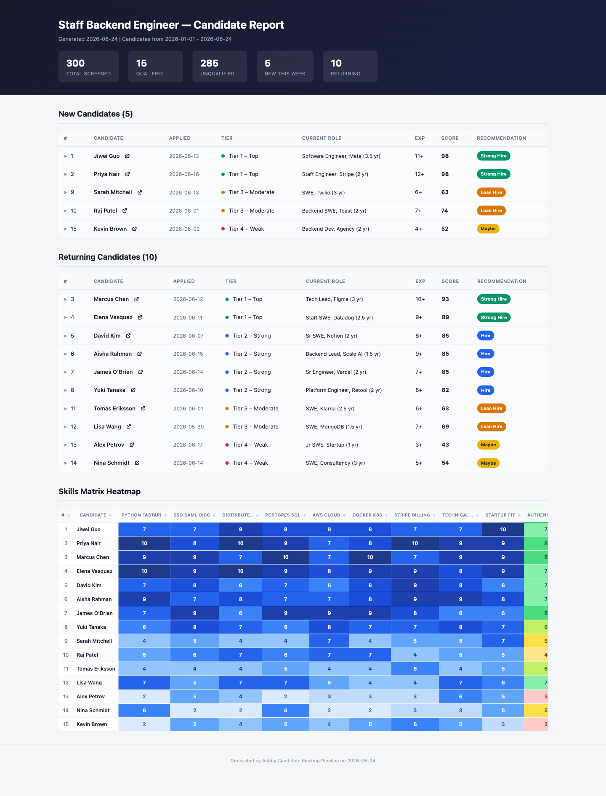
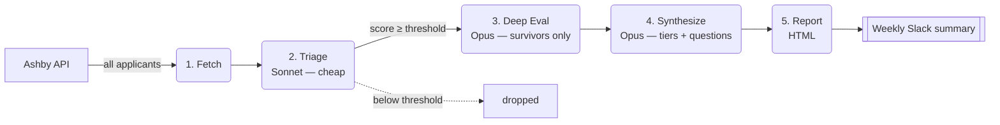

<div align="center">

# Ashby Candidate Screener

**AI-powered candidate screening for the [Ashby](https://www.ashbyhq.com/) ATS — tiered Claude evaluation that turns a pile of applicants into a ranked shortlist with per-candidate scores and tailored interview questions.**

[](https://github.com/matthewod11-stack/ashby-candidate-screener/actions/workflows/ci.yml)

</div>

<div align="center">
  <a href="https://matthewod11-stack.github.io/ashby-candidate-screener/"></a>
  <p><sub>Sample report rendered from synthetic data — summary stats, ranked tiers with hire recommendations, per-candidate scores, and a skills heatmap.</sub></p>
  <p><strong>▶ <a href="https://matthewod11-stack.github.io/ashby-candidate-screener/">See the live demo report</a></strong> — the real output, hosted, nothing to install.</p>
</div>

## Try it in 30 seconds

No Ashby, no API keys — render a sample report from bundled synthetic data:

```bash
python run.py --demo
```

Run it on **your own résumés** (a folder of `.md` / `.txt` / `.pdf` files plus a
`candidates.csv`) — needs only an Anthropic API key, no ATS:

```bash
python run.py --role staff-backend-engineer --source local --input-dir examples/sample-candidates
```

See [`examples/`](examples/) for the format.

## About

Screening hundreds of applicants by hand doesn't scale. This pipeline pulls every candidate for a role from Ashby, evaluates each résumé with a **cost-aware, tiered LLM pipeline**, and produces a self-contained HTML report — ranked tiers, dimension-by-dimension scores, and interview questions written for each finalist. It can post a weekly summary to Slack.

The expensive model never touches the whole pile: a cheap model triages everyone first, and only the survivors get a deep evaluation. The core is **ATS-agnostic** — Ashby is the implemented connector, but the scoring, reporting, and delivery logic don't know or care which ATS the data came from.

## How it works



| Stage | Model | What it does |
|---|---|---|
| 1 · Fetch | — | Pull all candidates + résumé PDFs from Ashby (parallel) |
| 2 · Triage | Claude Sonnet | Cheap pass/fail score across the whole pool |
| 3 · Deep Eval | Claude Opus | Detailed scoring on configured dimensions — **survivors only** |
| 4 · Synthesize | Claude Opus | Final tiering + tailored interview questions |
| 5 · Report | — | Self-contained HTML dashboard per role |

## Why it's built this way

- **Tiered evaluation keeps cost sane.** Running your most capable (and expensive) model on 600 résumés is wasteful when most are clear no's. Sonnet triages everyone for cents; Opus only deep-dives the candidates who clear the bar.
- **Prompt caching is on by default.** Triage and deep-eval system prompts are sent as cache blocks — cache reads bill at ~10% of the input rate within the cache window.
- **Every API call is costed.** A per-run ledger prints token usage and dollar cost per stage, so you always know what a run cost.
- **Score thresholds, not hard cutoffs.** Output volume tracks the actual quality of the pool — no arbitrary "top 20." Control it with `min_score` and tier filters.
- **Resumable and crash-safe.** Each stage writes JSON; `--resume` skips completed stages. Cached evaluations carry across runs, so returning candidates aren't re-scored.

## Tech stack

| Tool | Role |
|---|---|
| Python 3.14 | Pipeline runtime |
| [Anthropic SDK](https://docs.anthropic.com/) | Claude — Sonnet (triage), Opus (deep eval + synthesis) |
| httpx | Ashby REST API client |
| Jinja2 | HTML report rendering |
| PyYAML · python-dotenv | Config and secrets |

## Getting started

```bash
git clone https://github.com/matthewod11-stack/ashby-candidate-screener.git
cd ashby-candidate-screener

python3 -m venv .venv
source .venv/bin/activate
pip install -r requirements.txt

cp .env.example .env          # add ASHBY_API_KEY and ANTHROPIC_API_KEY
```

Then run the pipeline:

```bash
python run.py                       # default role: staff-backend-engineer
python run.py --role bdr            # a specific role
python run.py --all                 # every role in config/roles/
python run.py --role bdr --resume   # skip stages whose output already exists
```

Output lands in `data/roles/<slug>/` — stage JSON in `results/`, the HTML report in `reports/`.

## Configuring roles

A role is **one YAML + one Markdown job description** in `config/roles/`. The YAML controls scoring dimensions, model IDs, the triage threshold, and report filters; the Markdown is the full JD fed into the prompts. **Adding a role requires no code changes** — drop in two files and run with `--role <slug>`.

> [!IMPORTANT]
> The three roles included here — `staff-backend-engineer`, `fde`, and `bdr` — are **generic baseline templates** so the pipeline runs out of the box. Before using this for real hiring, replace the company name (`Acme AI`), the `must_have` / `strong_signals` / `red_flags` criteria, and the scoring dimensions in each role's YAML and `.md` with details specific to **your** organization and roles. The quality of the ranking is only as good as the criteria you give it.

## Project layout

```
run.py            # Orchestrator: argparse → load role config → run stages
models.py         # Shared dataclasses + JSON helpers
state.py          # Per-role dedup + cached evals
usage.py          # Token + cost ledger
stages/           # One module per pipeline stage (fetch → … → report) + Slack
config/roles/     # Per-role YAML + Markdown JD (the unit of customization)
templates/        # Jinja2 HTML report template
```

See [`CLAUDE.md`](CLAUDE.md) for the full architecture, stage-output contract, and conventions.

## License

[MIT](LICENSE) © Matt OD

---

<sub>Built with Python and the Claude API. Developed with [Claude Code](https://claude.com/claude-code).</sub>
